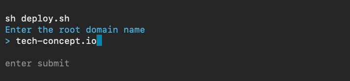
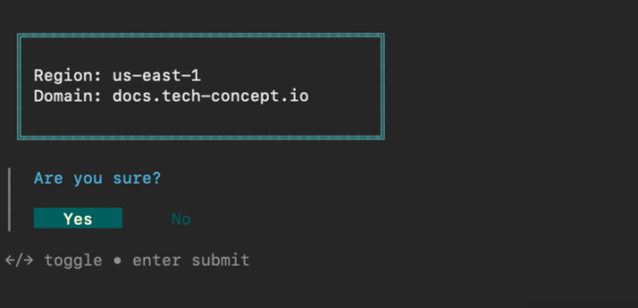

## Introduction
I've worked at a number of small companies over the years, and publishing documentation was always a sore point.  In this article I'll go through one of the better solutions I've found.  See the [DocsInfra repo](https://github.com/jsx7ba/docs) to see how the infrastructure is provisioned, and the [APIDocs]() docs the example Hugo project.

### Caveats

The solution below is going to work the best AWS is already being used, and not using GitHub.  If you are using GitHub, consider [GitHub Pages](https://pages.github.com/) before this solution.  If Word or PDF documents need generated, consider using [pandoc](https://pandoc.org/) instead of Hugo.

## Documentation Requirements

The properties of a good documentation system:
1. Sources are stored in version control: While precluding formats like Word, text formats like [Markdown](https://www.markdownguide.org/) or [ReStructuredText](https://docutils.sourceforge.io/docs/user/rst/quickstart.html) are easy to learn and provide the ability to merge different branches of documentation.
2. Searchable: The end result should be searchable.  I've found that using custom Google plugins can be akward as the index doesn't update as fast as the documentation can.
3. Internationalized: Native support for internationalization is way better than than modifying an existing system.
4. Automated Deployment: A DevOps model for deployment on push simplifies a potentially error prone process.  In a previous life, I've spent a few long nights updating documentation on S3 by uploading upwards of 12 manually created zip files.

{{/*
Let's consider a 

1. Documentation changes are merged or pushed to the master branch.
2. A continuous delivery system uses [hugo](https://gohugo.io/) to build the HTML and deploy it to an [S3](https://aws.amazon.com/s3/) bucket.
3. A [CloudFront](https://aws.amazon.com/cloudfront/) distribution will detect S3 Bucket changes and update within 24 hours.  Note that [staging](https://docs.aws.amazon.com/AmazonCloudFront/latest/DeveloperGuide/working-with-staging-distribution-continuous-deployment-policy.html) can be used to update caches at a specific time, and [cache invalidations](https://docs.aws.amazon.com/AmazonCloudFront/latest/DeveloperGuide/Invalidation.html) will cause immediate updates.
4. Bask in the glory you get to do other things now.
*/}}

## AWS Infrastructure

The goal is to update an S3 bucket with the new HTML documentation on git push or merge.  The S3 bucket is configured to serve a static website, and a CloudFront distribution is configured to serve HTTPS from that bucket.

A continuous delivery system like [GitHub Actions](https://docs.github.com/en/actions) or [BitBucket Pipelines](https://www.atlassian.com/software/bitbucket/features/pipelines) executes Hugo to generate HTML and directly update the S3 Bucket. 

There's some additional infrastructure needed to make this work.  CloudFront requires an ACM Certificate in the `us-east-1` region. Due to that requirement, it's simpler to provision all the infrastructure in that region.  Hugo `deploy` requires AWS Credentials so an IAM User with a policy that can _only_ update the S3 Bucket is created.  A root domain is required to be hosted on Route53.  If the root domain is `example.com`, the documentation will be accessible at `docs.example.com`. Note CloudFront will not serve to a root domain.  Finally, CloudFormation is used to provision everything and to keep resources organized.

The is a deployment script which uses [gum](https://github.com/charmbracelet/gum) for prompts and status.

### Deploying CloudFormation Stack

Clone the [DocsInfra](https://github.com/jsx7ba/docsinfra) repository and run `deploy.sh`.  Entering the root domain is all it takes to deploy all the infrastructure. 






### Configuring Hugo

With the infrastructure in place, the following steps are used to configure a Hugo documentation project.
Hugo theme: https://github.com/bep/docuapi

1) install hugo

2) configure a new site
```bash
hugo new site product_docs -f yaml
cd product_docs
yq -i -oy '.' hugo.toml && mv hugo.toml hugo.yaml # can't have nice things
git init
git submodule add https://github.com/bep/docuapi.git themes/docuapi
echo "theme: docuapi" >> hugo.yaml
```

3) Add some content to the content directory

4) Add Github Actions

5) push

